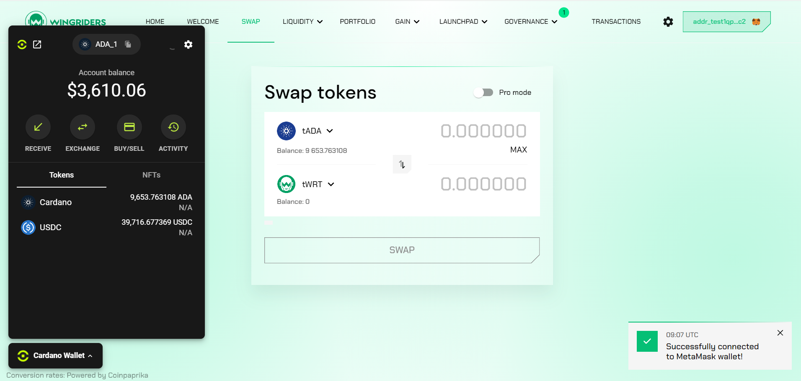

# Overview

## Introduction

**This service is coming soon.**

Cardano Wallet is coming to MetaMask. Thanks to [Snaps](https://snaps.metamask.io/), the Cardano ecosystem will be directly accessible to MetaMask’s millions of users. Using the Cardano Wallet Snap, users can interact with Cardano dApps directly through their MetaMask.

With the Cardano Wallet Snap, a MetaMask user can start using a Cardano DApp in under 10 seconds. Here’s how it works:

1. The user navigates to a Cardano DApp and selects MetaMask from the wallet options.

2. The user is prompted to install Cardano Wallet Snap in their MetaMask wallet.

3. The user’s MetaMask Cardano wallet – created for them behind the scenes instantly – is successfully connected to the DApp.



## How it works

The MetaMask Cardano Wallet consists of two main components:

1. **Cardano Wallet Snap**\
   A MetaMask Snap that enables the user’s MetaMask wallet to derive Cardano keys and sign Cardano transactions. The Snap is installed by the user and runs directly in the MetaMask browser extension wallet. When asked to sign a transaction, the Snap triggers a MetaMask popup, and the user must confirm the action in the MetaMask wallet.
2. **NuFi Widget**\
   The NuFi widget is a DApp-integrated wallet UI that provides complete wallet functionalities such as managing and sending Cardano assets, including NFTs, purchasing ADA with a credit card, cross-chain exchange, and a Cardano DEX aggregator. The widget is integrated into the DApp via SDK and serves as a user-friendly layer between the MetaMask and the DApp.

<figure><figcaption></figcaption></figure>

For additional functionalities like staking, detailed portfolio overview, sending multiple tokens, and more, users can simply open the NuFi dashboard. It can be accessed directly from the widget or via [wallet.nu.fi](http://wallet.nu.fi).

<figure><figcaption></figcaption></figure>

In a common scenario, a sign transaction request from a DApp is sent to the NuFi widget, which shows transaction details and prompts the user to confirm. If the user confirms, the NuFi widget asks MetaMask to sign the transaction. MetaMask displays a popup, and if the user confirms, it signs the transaction.



## Security

Cardano Wallet Snap provides MetaMask with the capability to derive Cardano keys and sign Cardano transactions using these keys. The Snap is open-source and [audited](https://sayfer.io/audits/metamask-snap-audit-report-for-nufi/).

The NuFi widget is a bridge between a Cardano DApp and MetaMask. When the user initiates a transaction, they first review and approve the transaction inside the NuFi widget. After the transaction is approved in the widget, the MetaMask wallet launches and prompts the user to approve and sign the transaction in MetaMask’s interface. If approved in MetaMask, the signed transaction is returned to NuFi widget and submitted on the Cardano blockchain.

Important to know: the private key is never shared with the DApp or NuFi widget. The derivation of the private key and transaction signing always happens in the MetaMask core.

### Seed phrase backup

The Cardano Wallet keys are derived directly from the MetaMask seed phrase. Users can easily export their MetaMask seed phrase and import it into any other Cardano wallet that supports a 12-word phrase.
